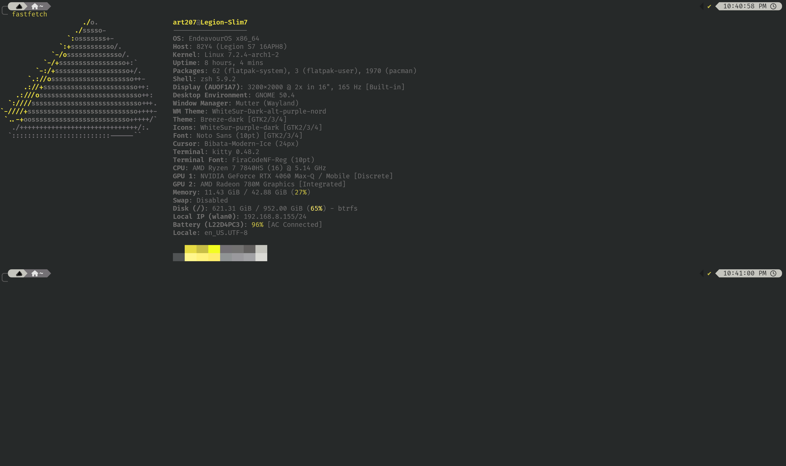
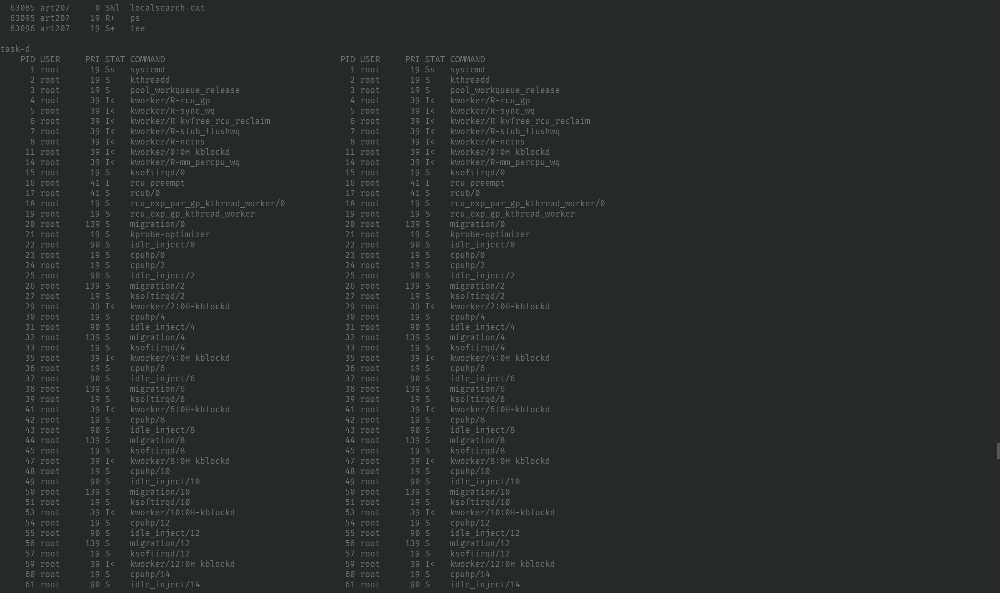
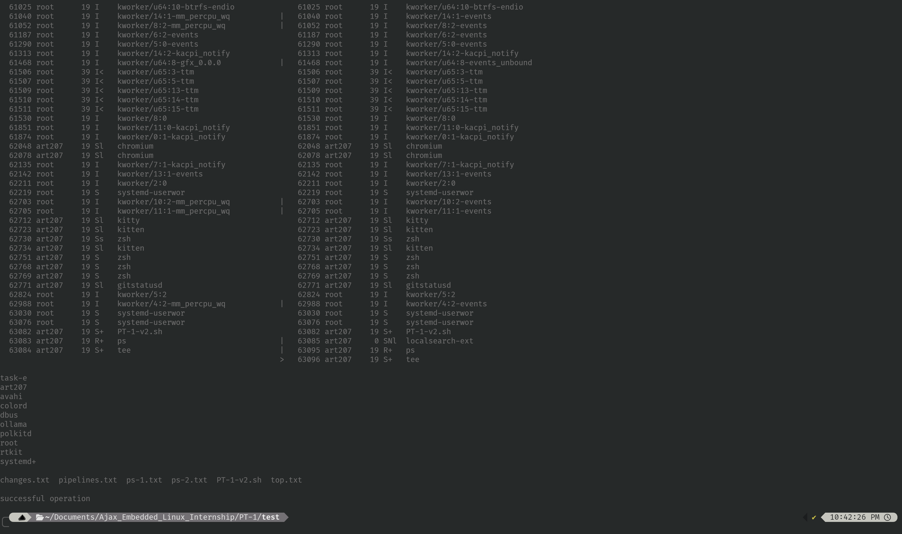

# Звіт TASK 01  
## Базова робота з Unix-подібними ОС

# 0. Створення робочого місця на основі Linux

а) Якщо ви вже використовуєте Linux в якості робочої системи (будь-який Desktop дистрибутив) - завдання вже виконане.

б) Рекомендується встановити віртуальну машину (VirtualBox, VMWare, еtc) та встановити туди будь який поширений Desktop дистрибутив (якщо немає вподобань, то рекомендується Ubuntu LTS).

в) Якщо є натхнення - спробувати використати в якості робочого середовища Windows WSL (але з вас розповісти для всіх нас про цей шлях)

Для перегляду інформації про систему використано команду:

```bash
fastfetch
```

`fastfetch` виводить основну інформацію про:

- операційну систему;
- ядро Linux;
- робоче середовище;
- процесор;
- оперативну пам'ять;
- графічний адаптер;
- оболонку;
- термінал;
- інші параметри системи.

### Результат



---

# 1. Проглянути стислий курс щодо командного рядка bash (https://www.w3schools.com/bash/index.php)

Було опрацьовано стислий курс з Bash на платформі W3Schools, а саме розділи:

- **Basic Commands** — основні команди;
- **System Monitoring** — моніторинг системи;
- **File Permissions** — права доступу до файлів;
- **File Compression** — архівування та стиснення;
- **Text Processing** — обробка текстових даних.

---

# 2. Виконання практичних завдань

Для автоматизації виконання завдань створено Bash-скрипт.

---

## 2.a) Створити текстовий файл з поточним списком всіх процесів в системі з вказанням ID процесу, користувача від імені якого запушений процес, пріоритет виконання, стан процесу, так коротким ім'ям команди що виконується  (див. ps)

Використана команда:

```bash
ps -eo pid,user,pri,stat,comm | tee ps-1.txt
```

### Пояснення

Команда:

```bash
ps
```

використовується для перегляду інформації про процеси.

Параметр:

```text
-e
```

означає виведення всіх процесів системи.

Параметр:

```text
-o
```

дозволяє вручну визначити формат виведення.

У роботі використовуються поля:

| Поле | Значення |
|---|---|
| `pid` | ідентифікатор процесу |
| `user` | користувач, від імені якого запущений процес |
| `pri` | пріоритет процесу |
| `stat` | поточний стан процесу |
| `comm` | коротке ім'я команди |

Команда:

```bash
tee ps-1.txt
```

одночасно виводить інформацію у термінал та записує її у файл `ps-1.txt`.

### Результат


---

## 2.b) Виконати моніторинг завантаженості системи (див top)

Для моніторингу поточного стану системи використано команду:

```bash
top -b -n 1 | tee top.txt
```

### Пояснення

`top` використовується для перегляду:

- завантаження процесора;
- використання оперативної пам'яті;
- кількості активних процесів;
- часу роботи системи;
- використання ресурсів окремими процесами.

Параметр:

```text
-b
```

переводить `top` у **batch mode**, тобто текстовий режим без інтерактивного інтерфейсу.

Параметр:

```text
-n 1
```

вказує виконати лише один цикл оновлення інформації.

Результат записується у файл:

```text
top.txt
```

### Результат


---

## 2.c) Повторити пункт а) , але результат занести в інший файл.

Через певний проміжок часу повторно виконується отримання списку процесів:

```bash
ps -eo pid,user,pri,stat,comm | tee ps-2.txt
```

Команда аналогічна попередній, але результат записується вже у файл:

```text
ps-2.txt
```

Таким чином отримано два знімки стану системи у різні моменти часу:

```text
ps-1.txt
ps-2.txt
```

Їх можна використати для подальшого порівняння.

### Результат


---

## 2.d) Проаналізувати як змінився стан процесів між моментами часу п. а) та в) (див diff)

Для аналізу змін між двома списками процесів використовується команда:

```bash
diff -y ps-1.txt ps-2.txt | tee changes.txt
```

### Пояснення

Команда:

```bash
diff
```

порівнює два текстові файли.

Параметр:

```text
-y
```

виводить їх у форматі **side-by-side**, тобто два відповідні рядки розташовуються поруч.

Порівнюються файли:

```text
ps-1.txt
ps-2.txt
```

Результат записується у:

```text
changes.txt
```

Між двома моментами часу список процесів може змінитися, оскільки:

- деякі процеси завершуються;
- створюються нові процеси;
- може змінюватися стан уже запущених процесів;
- можуть запускатися службові процеси, пов'язані з виконанням команд.

### Результат



---

## 2.e) Використовуючи pipelines виведіть список користувачів, від імені яких виконувалися процеси в моменти а) та в) без повторів, відсортований по зростанню, без повторів (див. cat, sort, awk, uniq, tail, etc).

Використаний pipeline:

```bash
awk '{print $2}' <(tail -n +2 ps-1.txt) <(tail -n +2 ps-2.txt) | sort -u | tee pipelines.txt
```

### Розбір pipeline

#### 1. Видалення заголовка

```bash
tail -n +2 ps-1.txt
```

та

```bash
tail -n +2 ps-2.txt
```

виводять файли, починаючи з другого рядка.

Перший рядок із заголовком:

```text
PID USER PRI STAT COMMAND
```

таким чином не потрапляє у подальшу обробку.

---

#### 2. Process substitution

Конструкція:

```bash
<(command)
```

Вона дозволяє передавати результат виконання команди іншій програмі так, ніби це звичайний файл.

У цьому випадку:

```bash
<(tail -n +2 ps-1.txt)
```

та

```bash
<(tail -n +2 ps-2.txt)
```

передають два списки процесів без заголовків команді `awk`.

---

#### 3. Отримання імен користувачів

```bash
awk '{print $2}'
```

виводить друге поле кожного рядка.

У результаті отримуються імена користувачів:

```text
root
art207
...
```

---

#### 4. Сортування та видалення повторів

```bash
sort -u
```

виконує одразу дві операції:

- сортує список;
- параметр `-u` залишає тільки унікальні значення.

Окремо використовувати `uniq` у цьому випадку не потрібно.

---

#### 5. Збереження результату

```bash
tee pipelines.txt
```

одночасно:

- виводить результат у термінал;
- записує його у файл `pipelines.txt`.

### Результат



---

# 3. Повний Bash-скрипт

Повна версія скрипта:

```bash
#!/bin/bash

echo "task-a"
ps -eo pid,user,pri,stat,comm | tee ps-1.txt &&
  echo

echo "task-b"
top -b -n 1 | tee top.txt &&
  echo

echo "task-c"
ps -eo pid,user,pri,stat,comm | tee ps-2.txt &&
  echo

echo "task-d"
diff -y ps-1.txt ps-2.txt | tee changes.txt
echo

echo "task-e"
awk '{print $2}' <(tail -n +2 ps-1.txt) <(tail -n +2 ps-2.txt) | sort -u | tee pipelines.txt &&
  echo &&
  ls &&
  echo &&
  echo "successful operation"
```

---

# 4. Створені файли

Після виконання скрипта створюються такі файли:

| Файл | Призначення |
|---|---|
| `ps-1.txt` | початковий список процесів |
| `top.txt` | інформація про завантаженість системи |
| `ps-2.txt` | повторний список процесів |
| `changes.txt` | результат порівняння двох списків |
| `pipelines.txt` | унікальний відсортований список користувачів |

---

# 5. Структура репозиторію

```text
.
├── README.md
├── script.sh
├── ps-1.txt
├── ps-2.txt
├── top.txt
├── changes.txt
├── pipelines.txt
└── images/
    ├── task-0.png
    ├── task-2a.png
    ├── task-2b.png
    ├── task-2c.png
    ├── task-2d.png
    └── task-2e.png
```